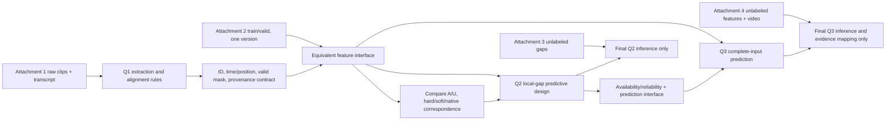

# Question dependency map

The correspondence comparison is a deferred evidence gate, not a Stage 1.5 selection. Full-to-partial teaching is optional and must first pass a complete-input teacher check. Q3 attribution is computed on the selected predictive interface and checked by interventions; neither a gate nor attention value is accepted as its definition.

Q1's independently produced 100 features document extraction/traceability; official Q2/Q3 parameter fitting remains on Attachment 2 train. Shared objects are specifications, not automatically identical numerical features. Model selection and thresholds: Attachment 2 valid only. Attachment 2 `test` and Attachments 3–4 must not guide selection unless official instructions later explicitly permit it.
